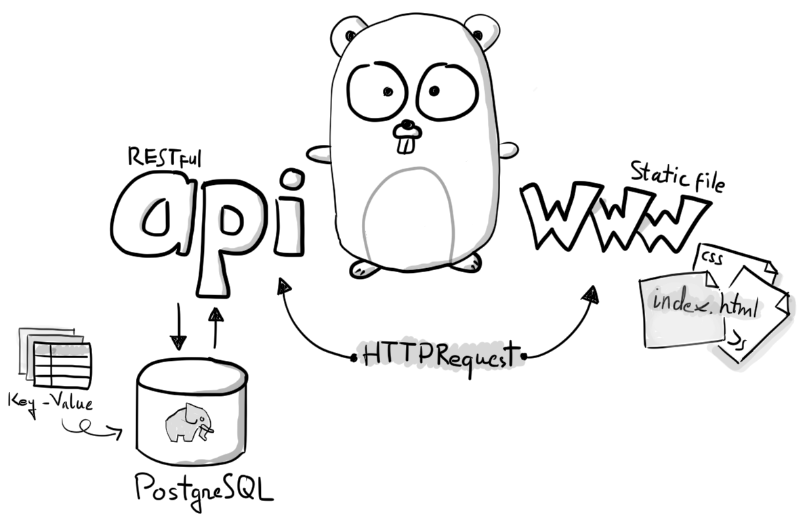

# apiToGo

**apiToGo** is an instant RESTful key-value API built with [Go](https://golang.org) and [PostgreSQL](https://www.postgresql.org/) database.

It was designed to easily deploy to [Heroku](https://www.heroku.com/) with just one click!

**apiToGo** both serve as a RESTful API and a static file server.

This allow you to focus on the front-end and create any fully working web application with no backend code needed!
